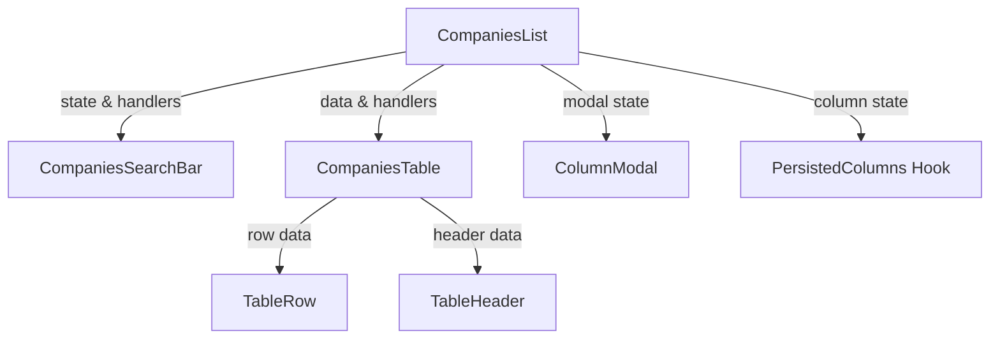
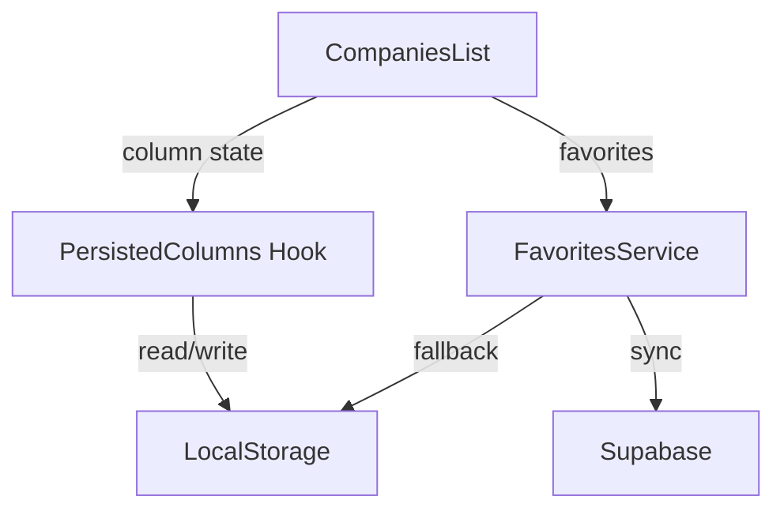
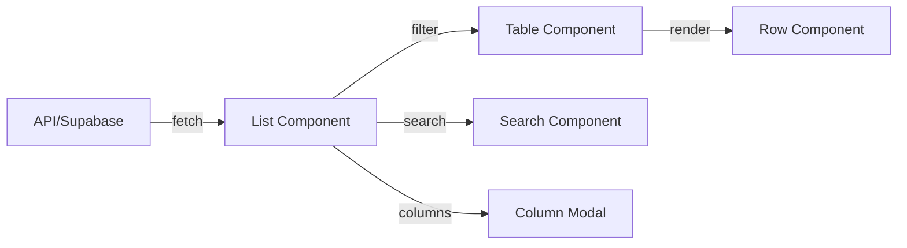
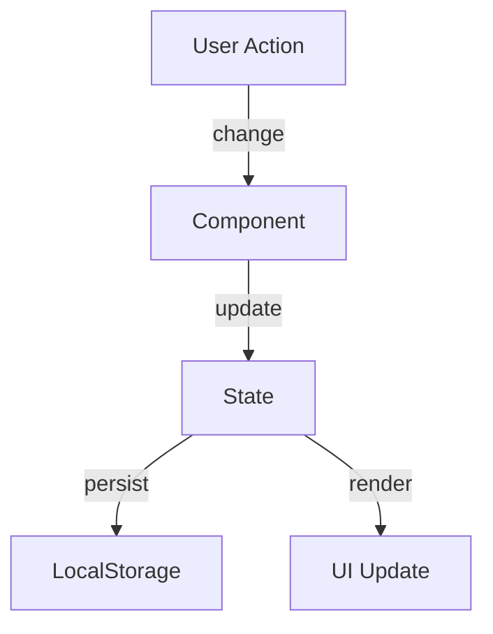

# System Architecture & Patterns

## Component Architecture

### Table System

### State Management

## Design Patterns

### Component Patterns
1. **Container Components**
   - `CompaniesList`: Manages state and data flow
   - `PersonsList`: Similar pattern for persons section
   - Handles data fetching, state, and child component coordination

2. **Presentational Components**
   - `CompaniesTable`: Pure rendering of data
   - `TableRow`: Handles single row presentation
   - `SearchBar`: User input interface

3. **Modal Components**
   - Controlled by parent state
   - Self-contained UI logic
   - Consistent close/apply pattern

### State Management Patterns
1. **State Lifting**
   - Column visibility state in parent
   - Modal state controlled by parent
   - Shared state at list level

2. **Persistence Patterns**
   - LocalStorage for user preferences
   - Supabase for server data
   - Fallback mechanisms for offline

3. **Event Handling**
   - Delegated to parent components
   - Consistent handler naming
   - Type-safe event props

## Data Flow

### Table Data Flow

### User Preferences Flow

## Implementation Guidelines

### Component Structure
- Clear separation of concerns
- State management at appropriate level
- Consistent prop patterns
- Type-safe interfaces

### State Management
- Prefer local state when possible
- Lift state when shared
- Use persistence for user preferences
- Handle loading/error states

### UI Patterns
- Consistent button placement
- Modal management
- Loading states
- Error handling

### Code Organization
- Feature-based directory structure
- Shared components in ui/
- Hooks in separate directory
- Service layer for API calls

## Recent Patterns Added

### Type-Based Content Organization
- Consistent grouping by content type (Companies/Persons)
- Unified navigation patterns based on type
- Shared styling between similar sections
- Clear visual hierarchy for grouped content

### Saved Searches Management
- Type-based filtering and display
- Consistent navigation patterns
- Integration with sidebar navigation
- Shared styling with favorites system

### Column Management
- State lifted to list component
- Persistence through localStorage
- Modal state controlled by parent
- Consistent button placement

### Button Organization
- Action buttons grouped in search bar
- Consistent styling and placement
- Clear visual hierarchy
- Standardized interaction patterns

### State Persistence
- User preferences in localStorage
- Fallback mechanisms
- Sync with server when available
- Clear update patterns
- Type-aware navigation and filtering

## Best Practices

1. **State Management**
   - Single source of truth
   - Clear update patterns
   - Type-safe state
   - Content type awareness

2. **Component Design**
   - Clear responsibilities
   - Consistent interfaces
   - Reusable patterns

3. **User Experience**
   - Consistent interactions
   - Predictable behavior
   - Persistent preferences
   - Type-based content organization
   - Unified navigation patterns

4. **Performance**
   - Optimized renders
   - Efficient data flow
   - Smart persistence
